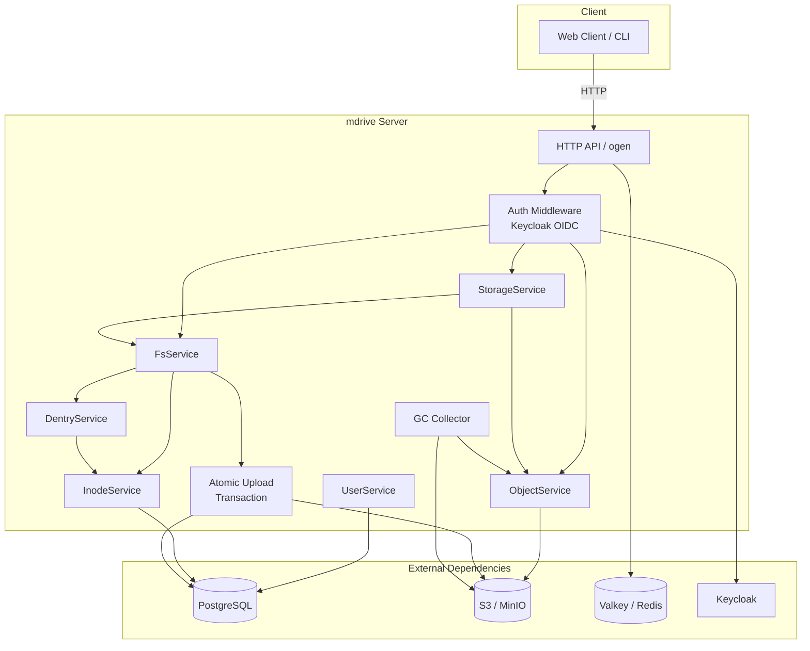
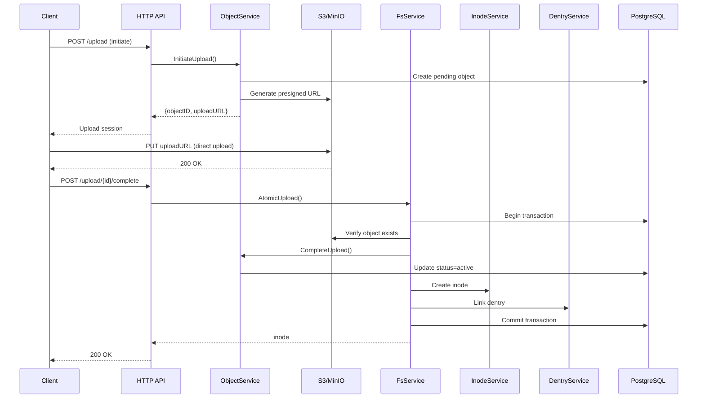
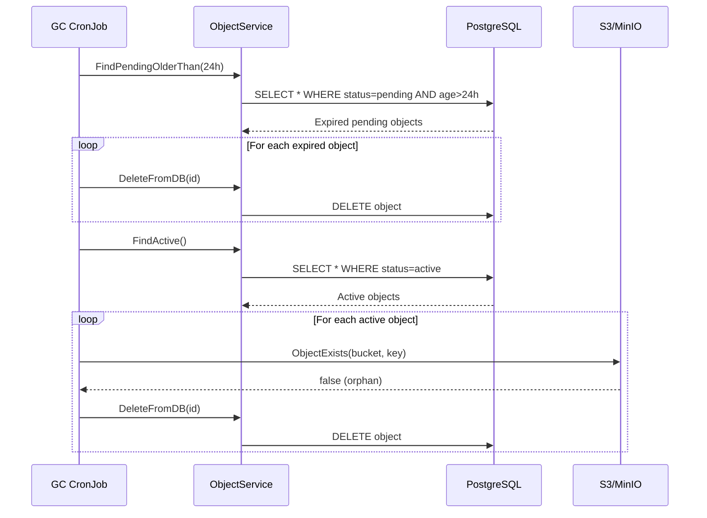

# mdrive

A distributed POSIX-like filesystem backed by object storage (S3/MinIO), built with Go.

## Architecture



## File Upload Flow



## Garbage Collection Flow



## Testing

| Test Type | Command | Description |
|-----------|---------|-------------|
| Unit | `make test` | Fast, no external deps |
| Integration | `make test-integration` | Postgres + MinIO via testcontainers |
| E2E | `make test-e2e` | Full HTTP server + database |
| Kind | `make test-kind` | Kind cluster + Helm chart |

## Quick Start

```bash
# Install hooks
make install-hooks

# Build
make build
./bin/mdrive serve --config config.yaml

# Run tests
make test
make test-integration
make test-e2e
make test-kind  # requires kind, kubectl, helm, docker
```

## Documentation

- [Architecture](docs/ARCHITECTURE.md) — Design philosophy, patterns, layers
- [Development](docs/DEVELOPMENT.md) — Quick start, conventions, commands
- [Testing](docs/TESTING.md) — Test pyramid, CI integration
- [Roadmap](docs/ROADMAP.md) — Completed, short term, medium term, long term

## Project Structure

```
.
├── api/                    # OpenAPI specs
├── build/                  # Dockerfiles
├── cmd/                    # Entry points
├── deployment/             # Helm charts
├── ent/                    # Ent ORM schema & generated code
├── internal/
│   ├── application/        # App services (fs, storage, gc)
│   ├── core/              # Domain models (inode, object, user, dentry)
│   ├── handler/           # HTTP handlers
│   └── cmd/serve/         # Server DI wiring
├── pkg/api/               # Generated ogen code
└── test/
    ├── e2e/               # End-to-end tests
    ├── integration/       # Integration tests (testcontainers)
    └── kind/              # Kind cluster tests
```

## License

IT
