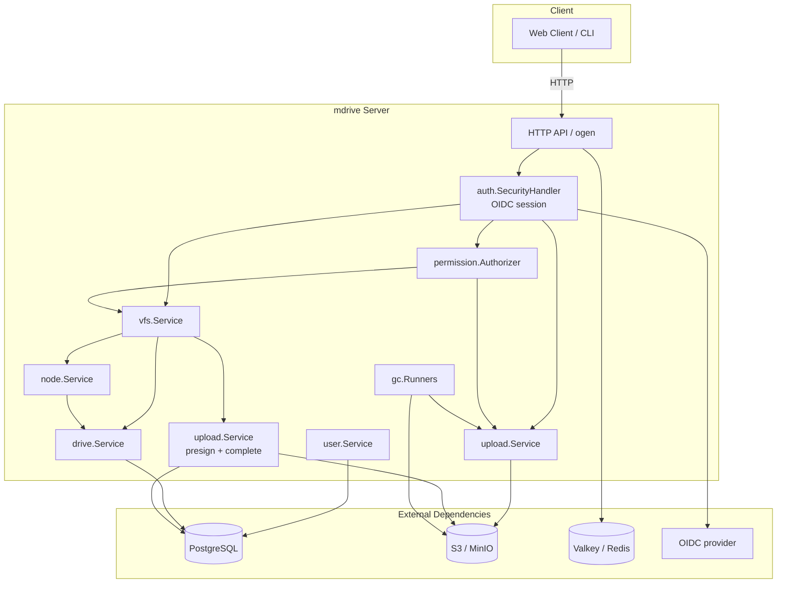
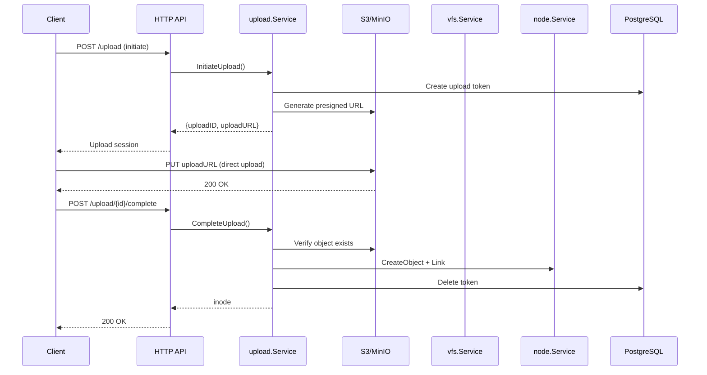
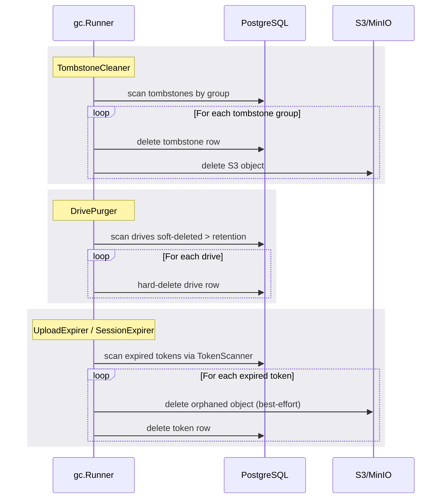

# mdrive

A distributed POSIX-like filesystem backed by object storage (S3/MinIO), built with Go.

## Architecture



## File Upload Flow



## Garbage Collection Flow



## Testing

| Test Type | Command | Description |
|-----------|---------|-------------|
| Unit | `make test` | Fast, no external deps |
| Integration | `make test-integration` | Handler + stub fakes (no Docker) |
| Integration (Ent) | `make test-integration-ent` | Real Postgres via testcontainers |
| E2E | `make test-e2e` | Full HTTP server + Postgres + Valkey |

## Quick Start

```bash
# Install hooks
make install-hooks

# Build
make build
./bin/mdrive api-server run --config config.yaml

# Run tests
make test
make test-integration-ent  # requires Docker
make test-e2e              # requires Docker
```

## Documentation

- [Architecture](docs/ARCHITECTURE.md) — Design philosophy, patterns, layers
- [Development](docs/DEVELOPMENT.md) — Quick start, conventions, commands
- [Testing](docs/TESTING.md) — Test pyramid, CI integration
- [Roadmap](docs/ROADMAP.md) — Completed, short term, medium term, long term

## Project Structure

```
.
├── api/                    # OpenAPI specs (ogen input)
├── charts/mdrive/          # Helm chart
├── cmd/mdrive/              # Entry point (thin, delegates to internal/cli)
├── config.yaml.example     # Example config (see charts/mdrive/values.yaml for canonical)
├── docs/                   # Architecture, development, testing, roadmap
├── ent/                     # Ent ORM schema & generated code
├── Dockerfile               # Container image build
├── internal/
│   ├── core/                # Domain layer (node, drive, user) — no I/O, no HTTP
│   ├── vfs/                 # Service: POSIX inode-tree manager
│   ├── upload/              # Service: S3 object lifecycle (+ s3/ client)
│   ├── permission/          # OpenFGA Authorizer (cross-cutting)
│   ├── auth/                # OIDC + sessions (cross-cutting)
│   ├── app/                 # Composition root (HTTP transport, GC jobs)
│   ├── apiopts/             # ogen Opt* wrapper helpers
│   ├── cli/                 # cobra commands
│   ├── config/              # Viper config loading
│   └── crypto/              # At-rest cipher for drive secrets
├── pkg/api/                 # Generated ogen code
└── test/
    ├── e2e/                 # E2E tests (Postgres + Valkey, testcontainers)
    └── integration/         # Handler integration tests (stub fakes + ent+testcontainers)
```

See `docs/ARCHITECTURE.md` for the layer-responsibility table.

## License

IT
